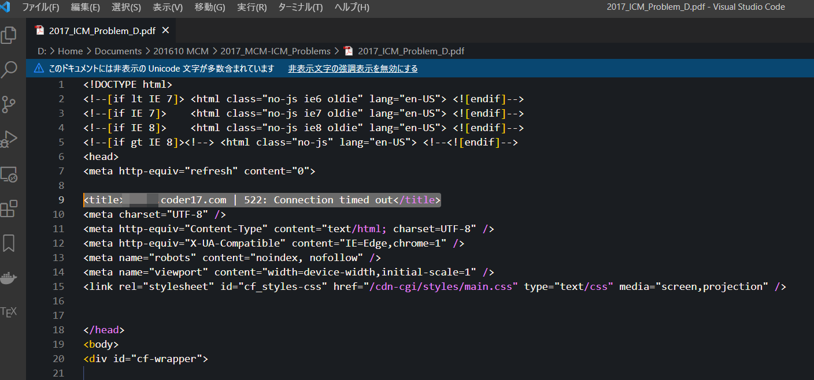

# Nextcloud file recoverer

[https://twitter.com/17tojo/status/1488205536923320325]()

In recent one year I often encounter with some PDF or office file damage error. I have been synced my file with a self-hosted nextcloud server, with the Windows client.

Anyway I can get my backup from server, but the local file repeatedly goes wrong sometimes.

Finally I surprisingly found that it is nextcloud Windows client that fucks up my files when network gets some error.

As in the picture, a PDF file was replaced by HTML error page codes, and results in file damage.

Fortunately, I have multiple levels of redundant backup so I can recover all of them automatically.

## On this script

This script try to read all the file under given path and check if the content has been replaced by nextcloud.

Here I use the page title as the feature string.

The filesize somehow remains the same. So check the file size before overwrite the damaged file just in case.

## Note

You have to have a back up for all your files.

Because the file damage is random, this script is to avoid the situation in which you replace all the file with backup and found your healthy work file also reverted to early version.

**Stop using nextcloud to backup, use Syncthings together with other server-side backup solutions.**

You can never have too many backups.